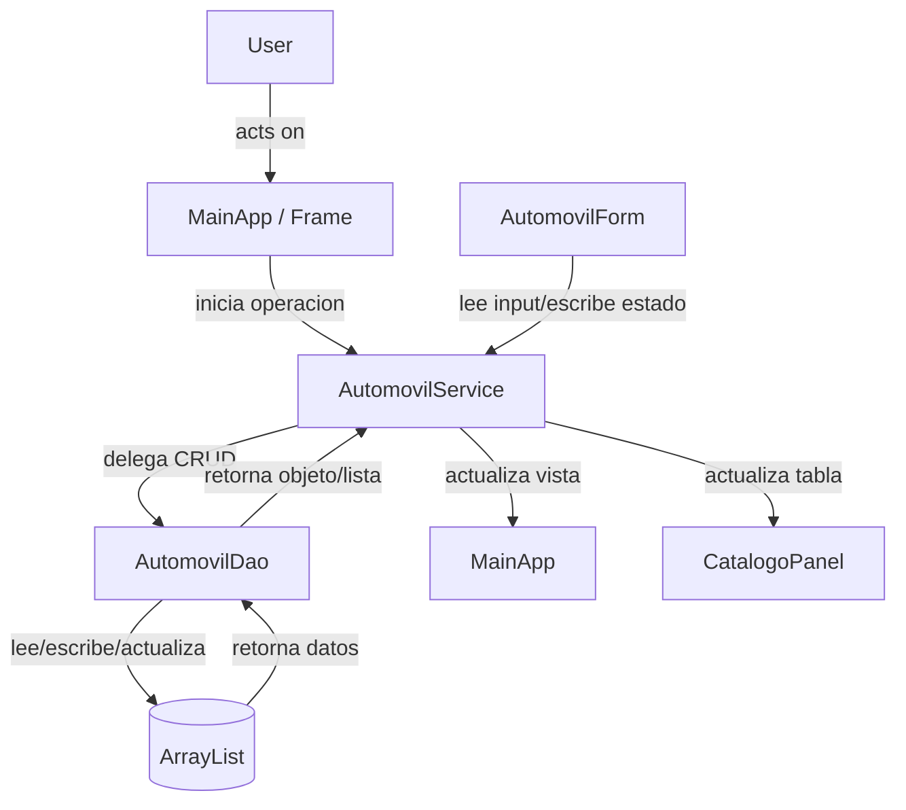

# JSwing CRUD Vehículos

<!-- Optional logo/banner: place it in docs/assets/ and reference it here (supports light/dark on GitHub). -->
<!-- <p align="center"></p> -->

[](https://github.com/RichardLitt/standard-readme)
[](LICENSE)
[](https://github.com/nedder3/jswing-crud-vehiculos/releases)
[]()
[]()
[]()

> Aplicación de escritorio para gestión de vehículos con interfaz Swing, persistencia en memoria y arquitectura layered.

## Table of contents

- [Background](#background)
- [Features](#features)
- [Tech stack](#tech-stack)
- [Quick Start](#quick-start)
- [Installation](#installation)
- [Usage](#usage)
- [Architecture and diagrams](#architecture-and-diagrams)
- [Contributing](#contributing)
- [License](#license)

## Background

Sistema de gestión de vehículos para demostración de arquitectura layered en Java Swing. Implementa un CRUD completo con interfaz gráfica, persistencia en memoria y pruebas unitarias.

## Features

- **Interfaz gráfica:** Tabla de vehículos con formulario de edición
- **Persistencia:** Almacenamiento en memoria con ArrayList
- **Arquitectura:** Layered (Model/DAO/Service/UI)
- **Pruebas:** TDD con JUnit

## Tech stack

| Layer | Technology | Notes |
|------|-----------|-------|
| Language | Java 17 | LTS |
| Framework | Swing | Desktop UI |
| Build | Maven | Dependency management |
| Tests | JUnit 5 | TDD |

## Quick Start

```bash
# Clone the repository
git clone git@github.com:nedder3/jswing-crud-vehiculos.git
cd jswing-crud-vehiculos

# Build and run
mvn clean package
java -jar target/jswing-crud-vehiculos-1.0.0.jar
```

## Installation

```bash
# Prerequisites
- Java 17
- Maven 3.9.9

# Build
mvn clean package
```

## Usage

```java
// Ejemplo de uso del DAO
AutomovilDao dao = new AutomovilDao();
Automovil auto = new Automovil("Toyota", "Corolla", "1.8L", "Blanco", "ABC123", 4);
// Crear
Automovil creado = dao.crear(auto);

// Leer
List<Automovil> todos = dao.leerTodos();

// Actualizar
creado.setModelo("Camry");
dao.actualizar(creado);

// Eliminar
dao.eliminar(creado.getId());
```

## Architecture and diagrams

Cy generates the flow/mechanism diagrams in [`diagramas/`](diagramas/). They are
viewed in Obsidian (canvas/mermaid) or rendered from the vault. One figure = one
assertion.

Directory tree:

```text
src/
  main/
    java/
      com/
        tienda/
          automoviles/
            model/        # Entidades
            dao/          # Acceso a datos
            service/      # Lógica de negocio
            ui/           # Interfaz gráfica
  test/
    java/
      com/
        tienda/
          automoviles/
            dao/          # Pruebas del DAO
```



## Contributing

Read [CONTRIBUTING.md](CONTRIBUTING.md). Key rules:
- Conversational commits with scope: `feat(jswing): ...`, `fix(jswing): ...`, `docs(jswing): ...`
- TDD: tests before declaring done.
- JSDoc on every public symbol.

See [CHANGELOG.md](CHANGELOG.md) for the change history.

## License

[MIT](LICENSE) © Ariel Jaime